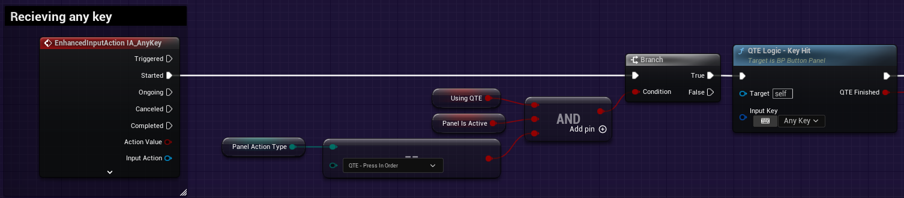
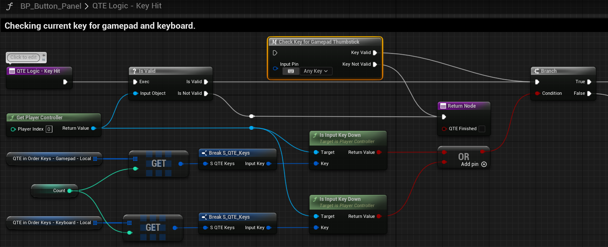
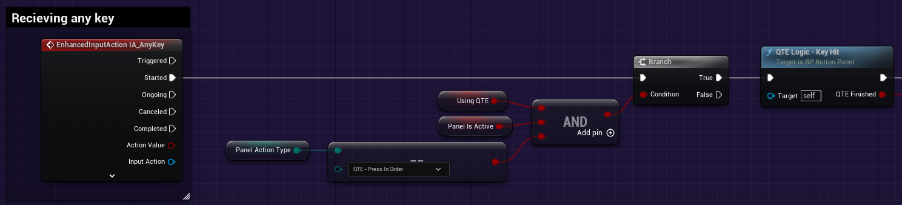
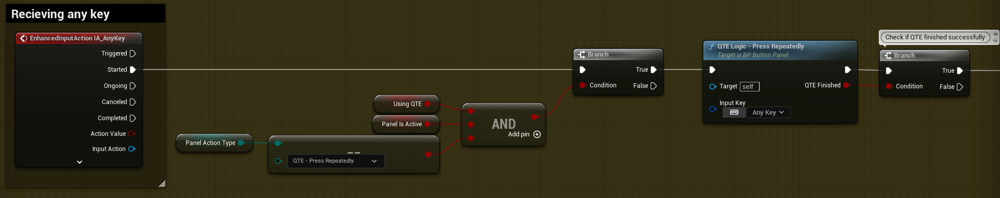
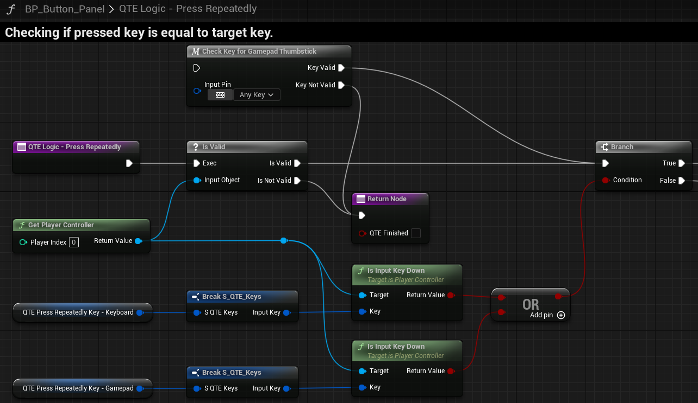
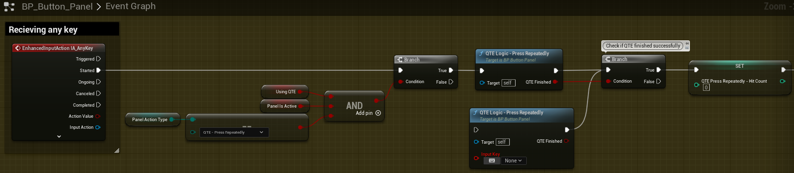

# BP_Button_Panel `EnhancedInput` Migration

There is some refactoring we need to do for the button logic with the new Enhanced Input.

## Event Graph

### QTE In Order Logic - player has to press keys in order to push button.

This is the Purple commented area of the `BP_ButtonPanel` Event Graph. Go to "Receiving Any Key". Since the EnhancedInput has the same actions being triggered by both Keyboard and Mouse and the Controller, we no longer need to track the `Key Input` or the `Gamepad Any Key Input`. We will remove the gamepad stack and focus only on the top `Key Input` stack for refactor.

>We will delete the logic that handles `IsKeyboardKey` and `IsGamepadKey` as this is no longer required. Delete the `InputAction Gamepad Any Key Input` stack up to `Set Current Key`. We no longer need to track the `Current Key` variable, so we can remove this from the function call to `QTE Logic - Key Hit`.
>
>

Next, we will update the `QTE Logic - Key Hit` function. Double click this function call to enter the function.

> We no longer need to track the `Current Key` in the caller and no longer need `Input Key` as the function input since we can simply query if the user is holding these keys down.
>
> Instead of comparing the `QTE` keys against the `InputAction` key, we will now check the expected `QTE` key(s) with `IsInputKeyDown`. The `Target` will be the value from `Get Player Controller` at index `[0]`.
>
>
>
>***NOTE**: Since `<AnyKey>` is broken in UE5 currently, the input mapping is setup such that specific keys are mapped. Additionally, we do not have the ability to pull which key is being used to activate the Action yet. With this in mind, the current mapping for `AnyKey` includes a bunch of keys around those required to be pressed on Keyboard as well as all controller buttons while excluding input from the left and right joysticks. Since we are ignoring the joysticks, we can bypass the `Check Key for Gamepad Thumbstick` until such a point in the future that `AnyKey` is no longer broken and we can check which key is triggering the `InputAction`.*

Next, we need to remove and add again the `QTE Logic - Key Hit` function call.

>We have to remove the original call to `QTE Logic - Key Hit` because it'll still have the expected `InputKey` input reference which we have removed. Deleting it and reconnecting the same `QTE Logic - Key Hit` function will show the input reference is now gone.
>

### QTE Press Repeatedly Logic - player has to press key certain amount of times until time limit expires.

>This work is done in the Yellow commented area of the `BP_ButtonPanel` Event Graph. Go to "Receiving Any Key". Similarly with the previous **QTE In Order** changes, we will remove the `Gamepad Any Key Input` and remove the `Is Keyboard Key` function call.
>
>

Next, we will update the `QTE Logic - Press Repeatedly` function. Double click this function call to enter the function.

> We no longer need to track the `Current Key` in the caller and no longer need `Input Key` as the function input.
>
> Additionally, instead of comparing the `QTE` keys against the `InputAction` key, we will now check the expected `QTE` key(s) with `IsInputKeyDown`. The `Target` will be the value from `Get Player Controller` at index `[0]`.
>
>
>
>***NOTE**: As previously mentioned, the `<AnyKey>` functionality is broken in UE5. We also don't have the ability to query the key that activated the `InputEvent` either.*

Next, we need to remove and add again the `QTE Logic - Press Repeatedly` function call.

>We have to remove the original call to `QTE Logic - Press Repeatedly` because it'll still have the expected `InputKey` input reference which we have removed. Deleting it and reconnecting the same `QTE Logic - Press Repeatedly` function will show the input reference is now gone.
>

Now we can delete teh `Current Key` Variable from `BP_Button_Panel`.