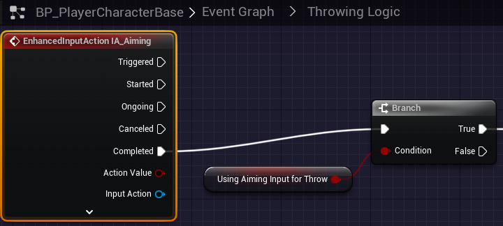
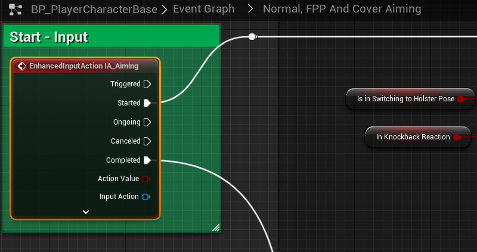
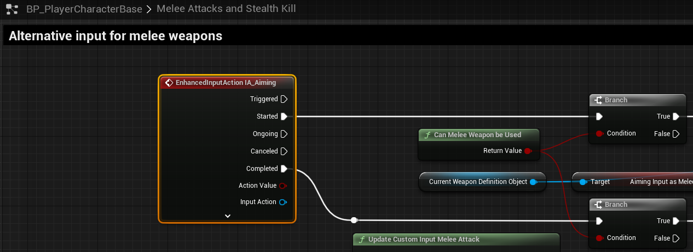

# `IA_Aiming`

## Add Player EnhancedInputAction for `IA_Aiming`.

### Aiming

#### Throwing Logic

>`BP_PlayerCharacterBase` -> `Event Graph` -> `Throwing Logic`
>Replace the following `Input Mappings`:
>
>`InputAction Aiming` -> `EnhancedInputAction IA_Aiming`
>
>Here, we are matching up `Completed` for the `Released` action.
>
>

#### Normal, FPP and Cover Aiming
>`BP_PlayerCharacterBase` -> `Event Graph` -> `Normal, FPP and Cover Aiming` -> `Start - Input`
>
>Replace the following `Input Mappings`:
>
>`InputAction Aiming` -> `EnhancedInputAction IA_Aiming`
>
>

#### Aternative Input for Melee Weapons
>`BP_PlayerCharacterBase` -> `Melee Attacks and Stealth Kills` -> `Alternative input for melee weapons`
>
>Replace the following `Input Mappings`:
>
>`InputAction Aiming` -> `EnhancedInputAction IA_Aiming`
>
>
