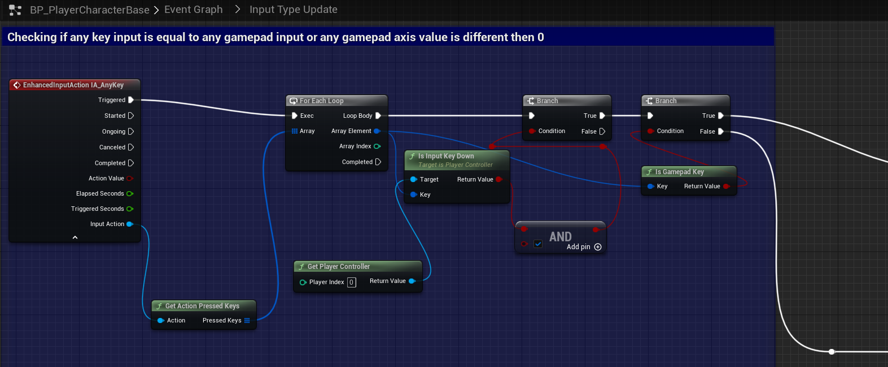

# `IA_AnyKey`

## Add Player EnhancedInputAction for `IA_AnyKey`.

### Input Type Update

Replaced `AnyKey` check with the following replacement.

>`BP_PlayerCharacterBase` -> `Event Graph` -> `Input Type Update`
>
>Replace the following `Input Mappings`:
>
>`InputAction AnyKey` -> `EnhancedInputAction IA_AnyKey`
>
> 

**!NOTE:** Additional required modification of `AnyKey` can be found in detail at the link for [BP_Button_Panel](./BP_Button_Panel_EnhancedInput.md) EnhancedInput modifications.