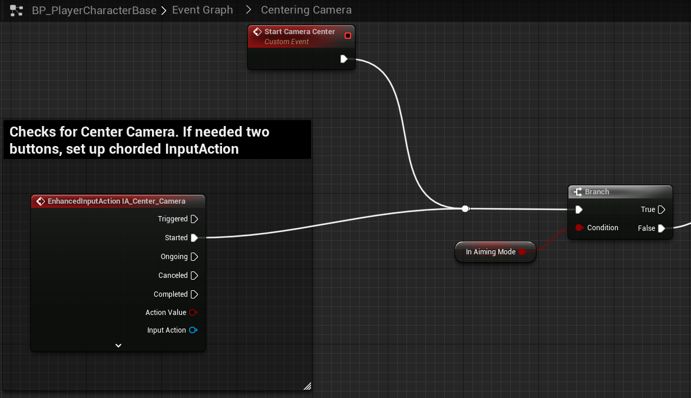

# `IA_Center_Camera`

## Add Player EnhancedInputAction for `IA_Center_Camera`.

### Centering-Resetting Camera

This logic is cumbersome. If needed to check multiple inputs, then set the EnhancedInput Action to Chorded type which allows for multiple keys to trigger.

> 