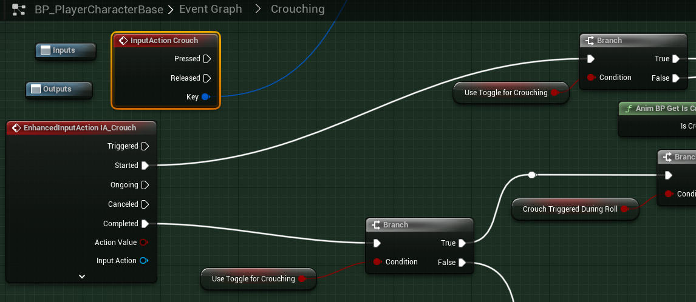
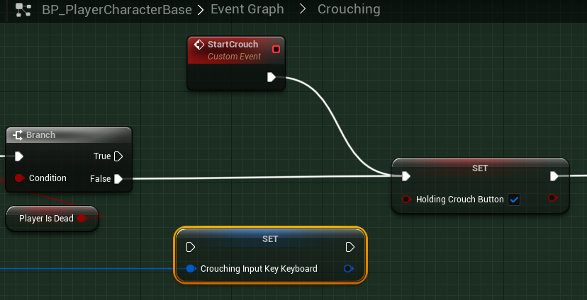

# `IA_Crouch`

## Add Player EnhancedInputAction for `IA_Crouch`.

#### Crouching

Modifying Crouching has multiple parts. This is because we are migrating to Enhanced Action, so we no longer need to track whatever Keyboard, Mouse, or GamePay key or button is pressed or still pressed. Instead, we are looking for the `Input Action` which is fired whenever a mapped key or button starts the trigger.

>`BP_PlayerCharacterBase` -> `Event Graph` -> `Crouching` -> `Crouching`
>
>Replace the following `Input Mappings`:
>
>`InputAction Crouch` -> `EnhancedInputAction IA_Crouch`
>
>

Next, we need to remove the `Key` output from the original `InputAction Crouch`. We can delete both `InputAction Crouch` and the `Set Crouching Input Key Keyboard` functions. With `Enhanced Input`, we don't need to track which key or button is being pressed to maintain state.

>`BP_PlayerCharacterBase` -> `Event Graph` -> `Crouching` -> `Crouching`
>
>Delete the following `Input Mappings`:
>
>`Set Crouching Input Key Keyboard`
>
>