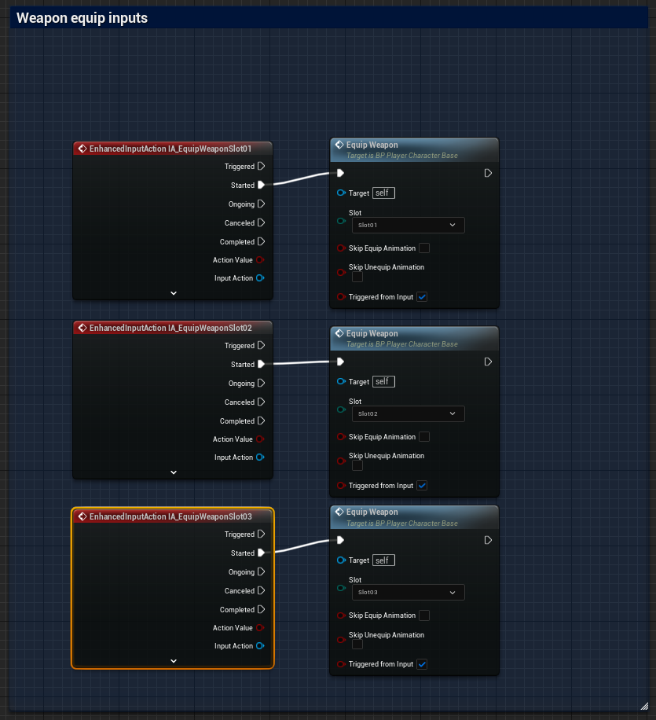
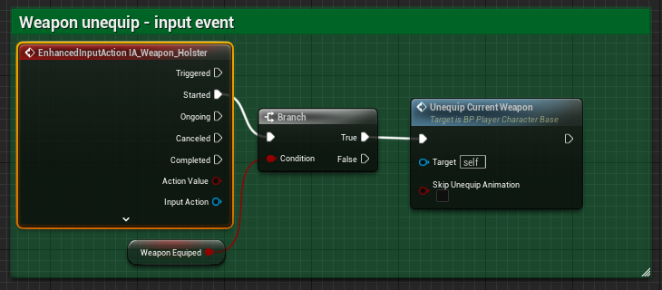

# `IA_EquipWeaponSlot_[##]`

## Add Player EnhancedInputAction for `IA_EquipWeaponSlot_01`,`IA_EquipWeaponSlot_02`, `IA_EquipWeaponSlot_03`.

### Add Player EnhancedInputAction to Weapon Equip.

>`BP_PlayerCharacterBase` -> `Event Graph` -> `Weapon Equip` -> `Weapon equip inputs`
>
>Replace the following `Input Mappings`:
>
>`InputAction EquipWeaponsSlot01` -> `EnhancedInputAction IA_EquipWeaponSlot01`
>`InputAction EquipWeaponsSlot02` -> `EnhancedInputAction IA_EquipWeaponSlot02`
>`InputAction EquipWeaponsSlot03` -> `EnhancedInputAction IA_EquipWeaponSlot03`
>
>

>`BP_PlayerCharacterBase` -> `Event Graph` -> `Weapon Equip` -> `Weapon Unequip-Input Event`
>
>Replace the following `Input Mappings`:
>
>`InputAction HolsterWeapon` -> `EnhancedInputAction IA_Weapon_Holster`
>
>