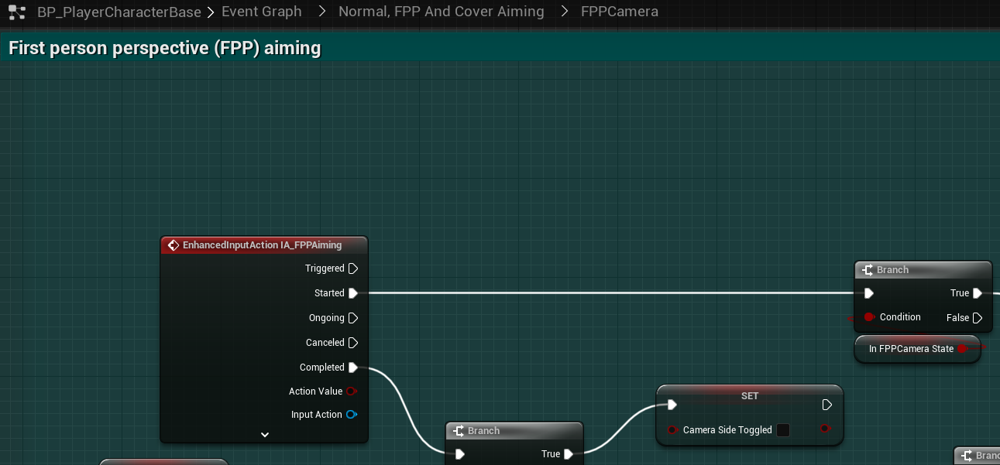

# `IA_FPPAiming`

## Add Player EnhancedInputAction for `IA_FPPAiming`.

### FirstPersonPerspective Aiming

>`BP_PlayerCharacterBase` -> `Event Graph` -> `Normal, FPP and Cover Aiming` -> `FPPCamera` -> `First person perspective (FPP) aiming`
>
>Replace the following `Input Mappings`:
>
>`InputAction FPPAiming` -> `EnhancedInputAction IA_FPPAiming`
>
>