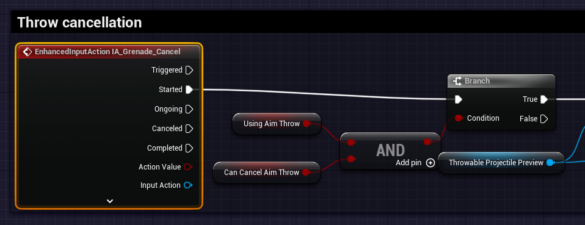

# `IA_Grenade_Cancel`

## Add Player EnhancedInputAction for `IA_Movement`.

### Cancel Grenade Throw

>`BP_PlayerCharacterBase` -> `Event Graph` -> `Throwing Logic` -> `Throw Cancellation`
>
>Replace the following `Input Mappings`:
>
>`InputAction GrenadeThrowCancel` -> `EnhancedInputAction IA_Grenade_Cancel`
>
>