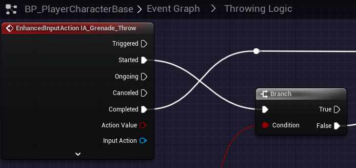

# `IA_Grenade_Throw`

## Add Player EnhancedInputAction for `IA_Grenade_Throw`.

### Throw Grenade

>`BP_PlayerCharacterBase` -> `Event Graph` -> `Throwing Logic`
>
>Replace the following `Input Mappings`:
>
>`InputAction GreandeThrow` -> `EnhancedInputAction IA_Grenade_Throw`
>
>