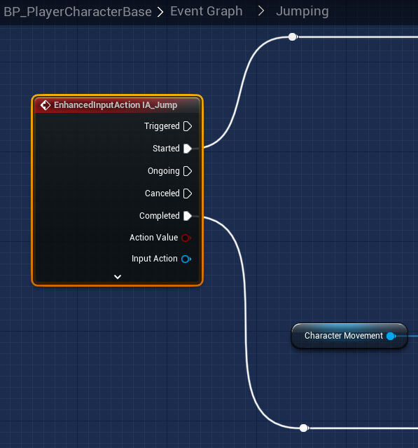

# `IA_Jump`

## Add Player EnhancedInputAction for `IA_Jump`.

### Jumping

>`BP_PlayerCharacterBase` -> `Event Graph` -> `Jumping` -> `Jumping`
>
>Replace the following `Input Mappings`:
>
>`InputAction Jump` -> `EnhancedInputAction IA_Jumping`
>
>