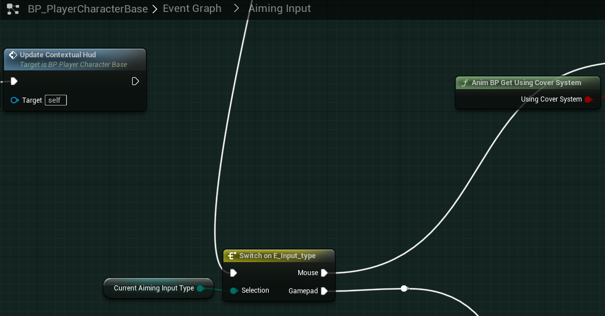

# `IA_Look_Mouse`

## Add Player EnhancedInputAction for `IA_Look_Mouse`

### Mouse Look movement

>`BP_PlayerCharacterBase` -> `Event Graph` -> `Aiming Input` -> `Look up/down -mouse`
>
>Replace the following `Input Mappings`:
>
>`InputAxis LookUpMouse` -> `EnhancedInputAction IA_Look_Mouse`
>
>
>
>`InputAxis Turn` -> `EnhancedInputAction IA_Look_Mouse`
>
>

Next, we must search all and replace legacy `InputAction` references with the new `EnhancedInput` actions.

>| Remove Legacy `InputAction` | Replace with `EnhancedAction` | Return Variable Out |
>| --- | --- | --- |
>| `Get Turn` | `Get IA_Look_Mouse` | `X` |
>| `Get LookUpMouse` | `Get IA_Look_Mouse` | `Y` |
>| `Get LookUp` | `Get IA_Look_Mouse` | `Y` |
>
> Example of one replacement:
>
>

### Refactor Camera Pitch/Yaw

In the legacy `InputAxis`, the mouse input is called every tick. With the new `EnhancedInput`, the mouse look action is only called when it is triggered. This does cause some strange behavior when trying to aim at something behind the player, but not actively moving the mouse. The player will aim, but not rotate towards the crosshairs. The work around is to refactor the camera pitch and yaw functionality.

To resolve this and provide the default expected behavior, we will create a custom event to execute the camera pitch and yaw updates. This event will be called during each tick.

> Under `Look up/down - mouse`:
>
>1. Move to `Switch on E_Input_Type`, and break the incoming pins.
>2. Replace the IA_Look_Mouse variable feed into `UpdateCameraPitch` with the `Y` variable from `Get IA_Look_Mouse`.
>3. Right click on the graph, and search for `Add Custom Event`. Add this, and rename to `TriggerUpdateLook`.
>4. From `TriggerUpdateLook`, we will execute a `Sequence`. Insert a `Sequence`.
>5. From the `Sequence` `Then 0`, feed this into the `Switch on E_Input_Type`.
>6. From the `Sequence` `Then 1`, feed this into the `Switch on E_Input_Type` for the `Look left/right - mouse`.
>
>
>
>

Since we have updated in `Aiming Input`, we now have to call this `TriggerUpdateLook` event in the `Event Tick`.

> `BP_PlayerCharacterBase` -> `Event Graph` -> `Tick Events`
>
> Add `TriggerUpdateLook` at the beginning of the `Event Tick`. This will have the movement occur before updating the crosshairs, recoil, etc...
>
>
