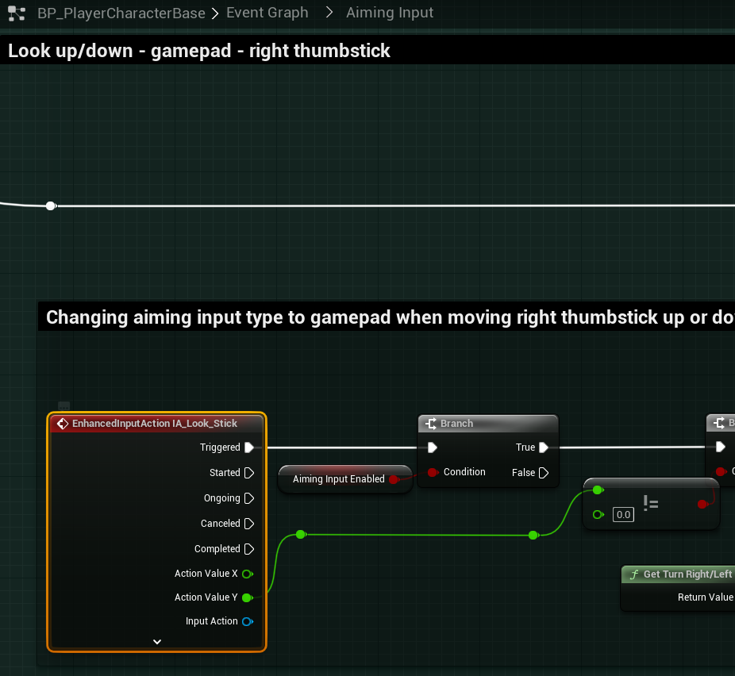
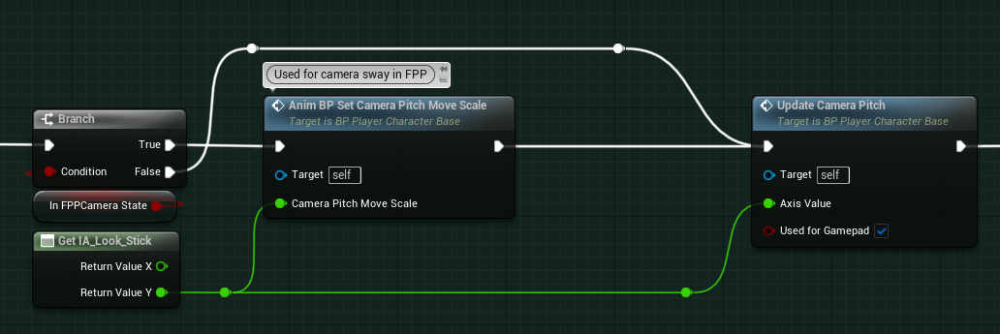
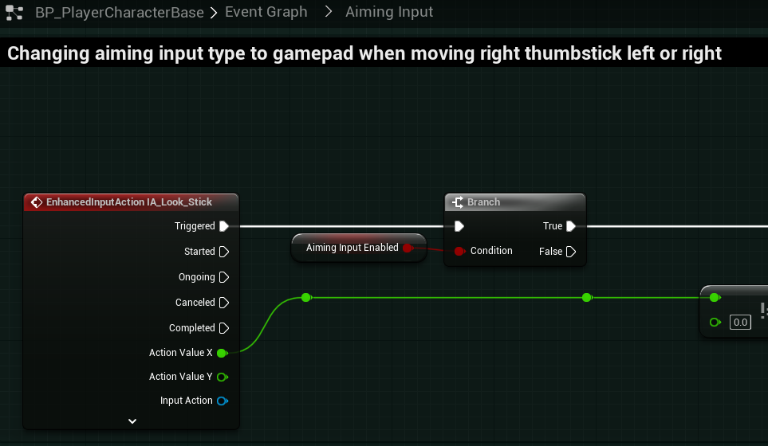
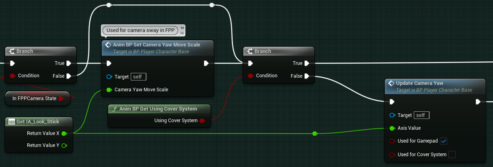
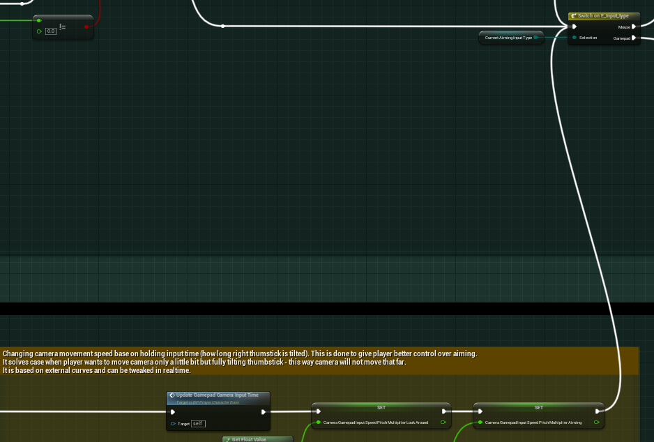

#### Gamepad Look Movement

>`BP_PlayerCharacterBase` -> `Event Graph` -> `Aiming Input` -> `Look up/down -mouse`
>
>`InputAxis LookUpGamepad` -> `EnhancedInputAction IA_Look_Stick`
>
>
>
>`Get LookUpGamepad` -> `Get IA_Look_Stick`
>Split the output struct, and utilize the `Return Value Y` for the input into `Anim BP Set Camera Pitch Move Scale` and `Update Camera Pitch`.
>
>
>
>`InputAxis Turn Right/Left` -> `EnhancedInputAction IA_Look_Stick`
>
>
>
>`Get Turn Right/Left` -> `Get IA_Look_Stick`
>Split the output struct, and utilize the `Return Value X` for the input into `Anim BP Set Camera Yaw Move Scale` and `Update Camera Yaw`.
>
>

Similarly with the Mouse Look events, you will need to replace all instances of `Get LookUpGamepad` with `Get IA_Look_Stick`, utilizing the `Y` variable and replace all instances of `Get Turn Right/Left` with `Get IA_Look_Stick`, utilizing the `X` variable.

Lastly, the experienced behavior from `EnhancedInput` is that the mouse movement isn't called every frame. Due to this reason, whenever we move the joystick, the `IA_Look_Mouse` isn't called every frame, and no movement will occur for aiming with the joystick. To resolve this, for both the `Look up/down` and `Look left/right` gamepad joystick stacks need to be adjusted. When we finish the last call to `Set Camera Gamepad Input Speed...` in the yellow commented sections, we need to then connect the next execute call to the `Switch on E_Input_Type` that occurs in the mouse stack.

>The same change will be applied to both `Look up/down` and `Look left/right`.
>
>

Next, we must search all and replace legacy `InputAction` references with the new `EnhancedInput` actions.

>| Remove Legacy `InputAction` | Replace with `EnhancedAction` | Return Variable Out |
>| --- | --- | --- |
>| `Get Turn Right/Left` | `Get IA_Look_Stick` | `X` |
>| `Get LookUpGamepad` | `Get IA_Look_Mouse` | `Y` |
>| `Get LookUp` | `Get IA_Look_Mouse` | `Y` |