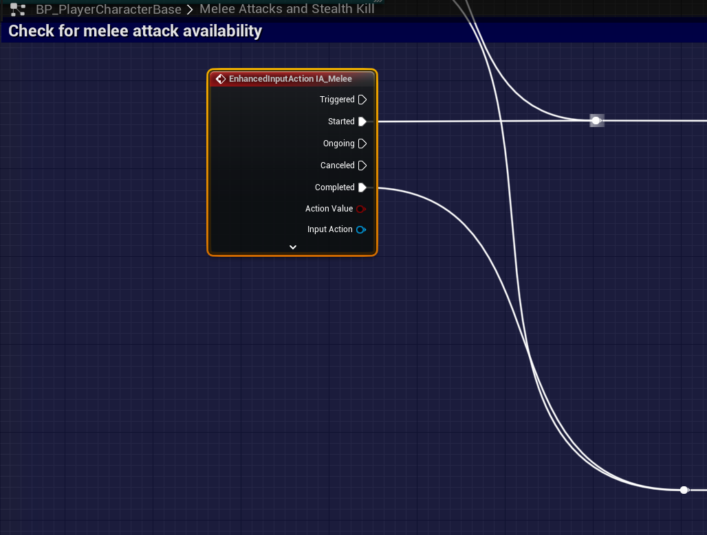

# `IA_Melee`

## Add Player EnhancedInputAction for `IA_Melee`.

### Melee; Melee Attacks and Stealth Kills

>`BP_PlayerCharacterBase` -> `Event Graph` -> `Ladder Movement` -> `Ladder Sliding Down`
>
>Replace the following `Input Mappings`:
>
>`InputAction Melee` -> `EnhancedInputAction IA_Melee`
>
>