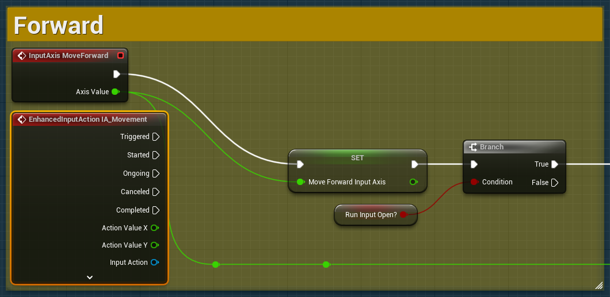
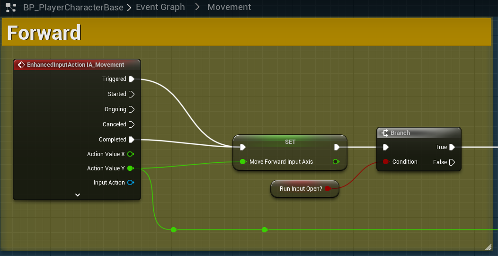
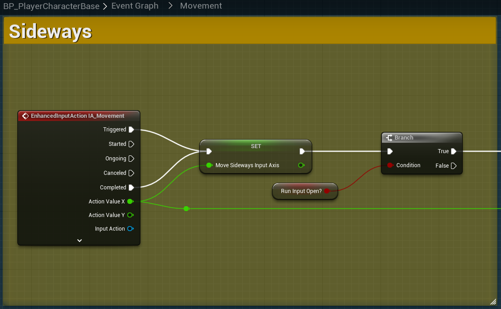

# `IA_Movement`

## Add Player EnhancedInputAction for `IA_Movement`.

### Forward/Backwards/Sideways

Now we need to migrate the player movement from the *Legacy* input actions to the new *Enhanced Input* bindings we recently created. Move into `BP_PlayerCharacterBase` -> `Event Graph` -> `Movement`.

>1. Add `EnhancedInputAction IA_Movement` to Forward.
>2. Set the `Triggered` point to call `Set Move Forward Input Axis`
>3. Set `EnhancedInputAction IA_Movement` `Action Value Y` to both of the `Axis Value` outputs from the initial `InputAxis MoveForward`.
>4. Break the remaining `Triggered` action from the *Legacy* `InputAxis MoveForward`.
>
>Stage 1:
>
>
>Stage 2:
>
>

Now, do the same thing for `Sideways`; however, this time connect the `Action Value X` for the variable output.

>

Next, we must replace legacy `InputAction` references with the new `EnhancedInput` action.

>| Remove Legacy `InputAction` | Replace with `EnhancedAction` | Return Variable Out |
>| --- | --- | --- |
>| `Get MoveSideways` | `Get IA_Movement` | `X` |
>| `Get MoveForward` | `Get IA_Movement` | `Y` |
>| `MoveRight` | `Get IA_Movement` | `X` |