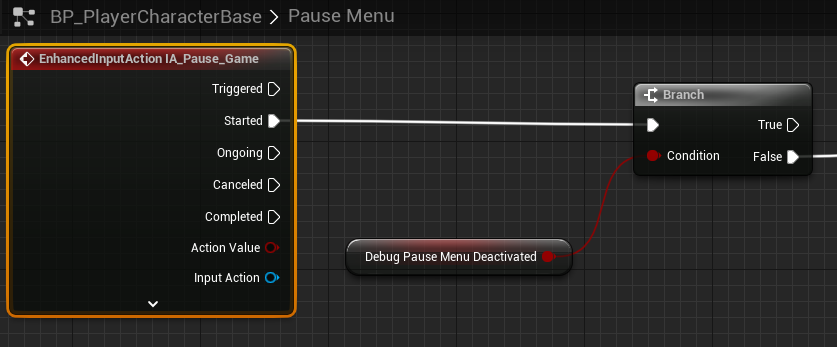

# `IA_Pause_Game`

## Add Player EnhancedInputAction for `IA_Pause_Game`.

#### Pause Menu

>`BP_PlayerCharacterBase` -> `Pause Menu`
>
>Replace the following `Input Mappings`:
>
>`InputAction PauseGame` -> `EnhancedInputAction IA_Pause_Game`
>
>