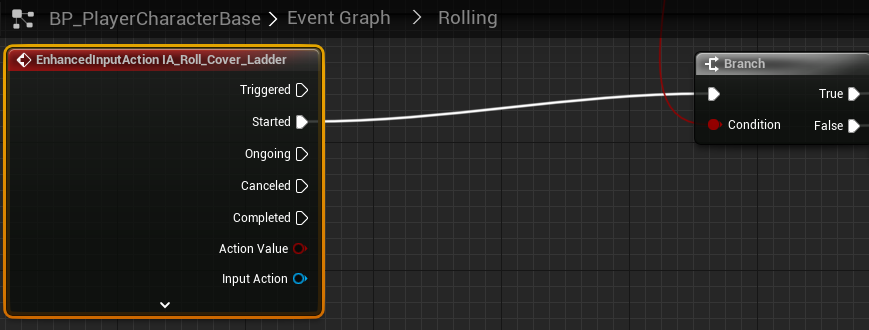

# `IA_Roll_Roll_Cover_Ladder`

## Add Player EnhancedInputAction for `IA_Roll_Roll_Cover_Ladder`.

### Rolling, Ladder Use & Cover

>`BP_PlayerCharacterBase` -> `Event Graph` -> `Rolling`
>
>Replace the following `Input Mappings`:
>
>`InputAction RollCoverLadder` -> `EnhancedInputAction IA_Roll_Cover_Ladder`
>
>