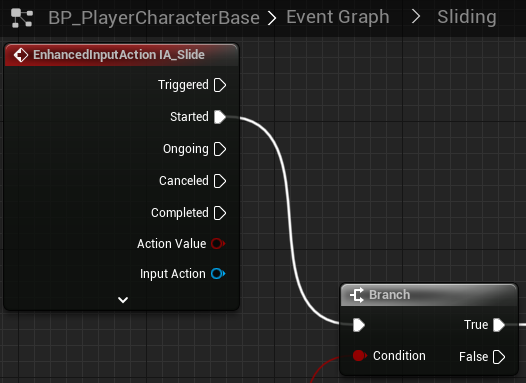

# `IA_Slide`

## Add Player EnhancedInputAction for `IA_Slide`.

### Sliding

>`BP_PlayerCharacterBase` -> `Event Graph` -> `Sliding`
>
>Replace the following `Input Mappings`:
>
>`InputAction Slide` -> `EnhancedInputAction IA_Slide`
>
>
