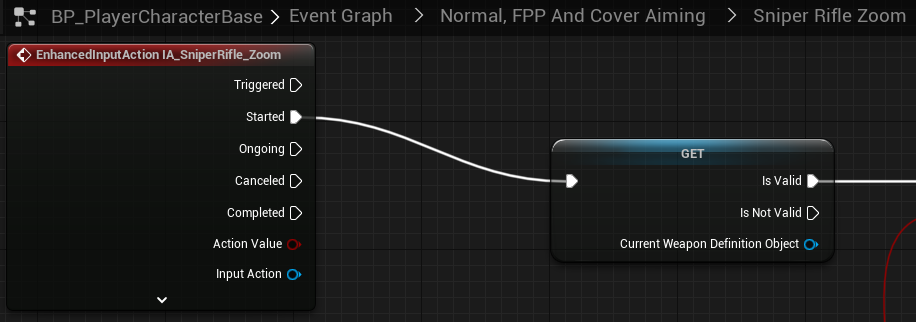

# `IA_SniperRifle_Zoom`

## Add Player EnhancedInputAction for `IA_SniperRifle_Zoom`.

### Sniper Rifle Zoom

>`BP_PlayerCharacterBase` -> `Event Graph` -> `Normal, FPP and Cover Aiming` -> `Sniper Rifle Zoom`
>
>Replace the following `Input Mappings`:
>
>`InputAction SniperRifleZoom` -> `EnhancedInputAction IA_SniperRifle_Zoom`
>
>
