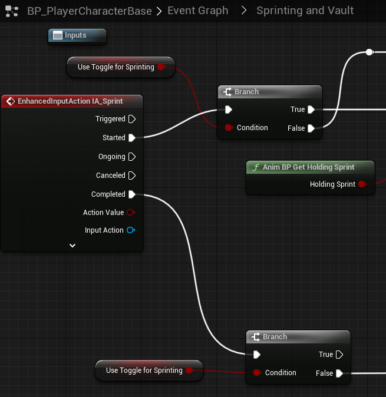
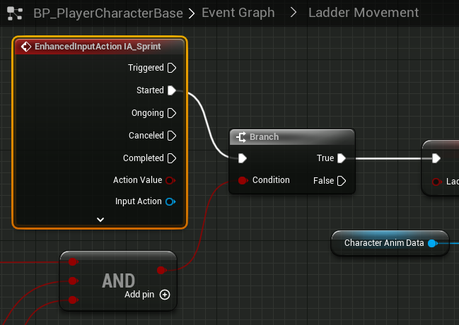

# `IA_Sprint`

## Add Player EnhancedInputAction for `IA_Sprint`.

### Sprinting

>`BP_PlayerCharacterBase` -> `Event Graph` -> `Sprinting and Vaulting` -> `Sprinting`
>
>Replace the following `Input Mappings`:
>
>`InputAction Sprint` -> `EnhancedInputAction IA_Sprint`
>
>

### Ladder movement

>`BP_PlayerCharacterBase` -> `Event Graph` -> `Ladder Movement` -> `Ladder Sliding Down`
>
>Replace the following `Input Mappings`:
>
>`InputAction Sprint` -> `EnhancedInputAction IA_Sprint`
>
>