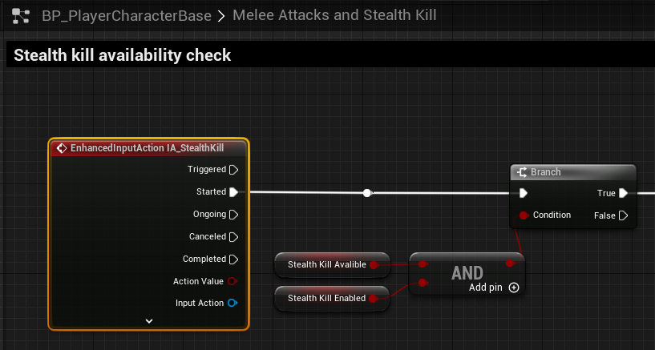

# `IA_StealthKill`

## Add Player EnhancedInputAction for `IA_StealthKill`.

### Stealth Kill; Melee Attacks and Stealth Kills

>`BP_PlayerCharacterBase` -> `Melee Attacks and Stealth Kill`
>
>Replace the following `Input Mappings`:
>
>`InputAction StealthKill` -> `EnhancedInputAction IA_StealthKill`
>
>