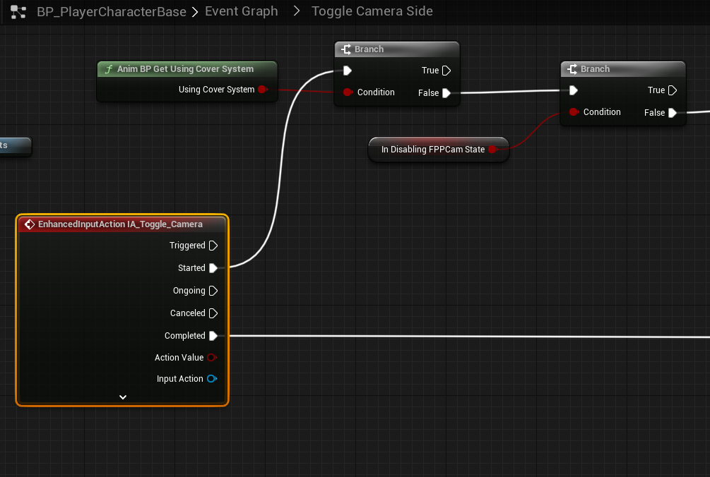

# `IA_Toggle_Camera`

## Add Player EnhancedInputAction for `IA_Toggle_Camera`.

#### Toggle Camera Side

>`BP_PlayerCharacterBase` -> `Event Graph` -> `Toggle Camera Side`
>
>Replace the following `Input Mappings`:
>
>`InputAction ToggleCamera` -> `EnhancedInputAction IA_Toggle_Camera`
>
> 