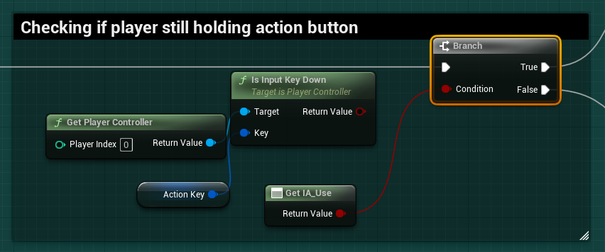

# `IA_Use`

## Add Player EnhancedInputAction for `IA_Use`.

### Use Item

>`BP_PlayerCharacterBase` -> `Event Graph` -> `Item Pickup`
>
>Replace the following `Input Mappings`:
>
>`InputAction Use` -> `EnhancedInputAction IA_Use`
>
> 

### BP_Button_Panel

Doing a quick search for the remaining InputActions, we can find several references in `Event Graph`.

>`BP_Button_Panel` -> `Event Graph`
>
>Replace the following `Input Mappings`:
>
>`InputAction Use` -> `EnhancedInputAction IA_Use`
>
>Also, delete the `Set Action Key` reference, as this is no longer needed. You can right click and search for references on this object before deletion so we can clean them up.
>
>

### Clean Up

Now we will clean up the `ActionKey` reference. Go to each reference and replace the logic to check if the action key is being held down so that we are querying the value of `Get IA_Use`. This boolean will tell whether the trigger value is `0` (`false`;not triggered) or `1` (`true`; triggered)
>

>`BP_Button_Panel` -> `Event Graph`
>
>Replace the following `Input Mappings`:
>
>`InputAction Use` -> `EnhancedInputAction IA_Use`
>
>Also, delete the `Set Action Key` reference, as this is no longer needed. You can right click and search for references on this object before deletion so we can clean them up.
>
>