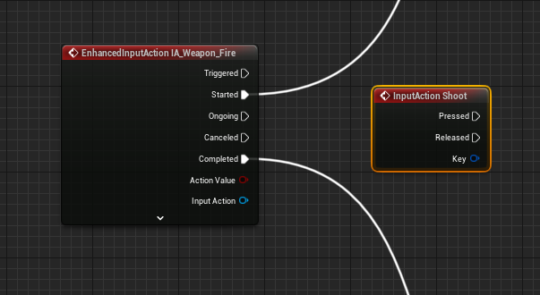
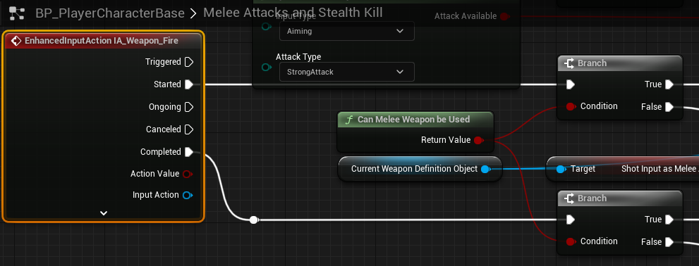

# `IA_Weapon_Fire`

## Add Player EnhancedInputAction for `IA_Weapon_Fire`.

#### Weapon Fire

>`BP_PlayerCharacterBase` -> `Event Graph` -> `Shooting`
>
>Replace the following `Input Mappings`:
>
>`InputAction Shoot` -> `EnhancedInputAction IA_Weapon_Fire`
>
>

#### Melee Attacks and Stealth Kill

>`BP_PlayerCharacterBase` -> `Melee Attacks and Stealth Kill`
>
>Replace the following `Input Mappings`:
>
>`InputAction Shoot` -> `EnhancedInputAction IA_Weapon_Fire`
>
>