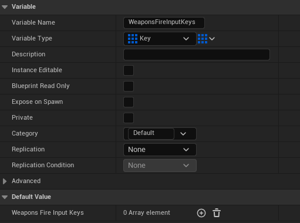
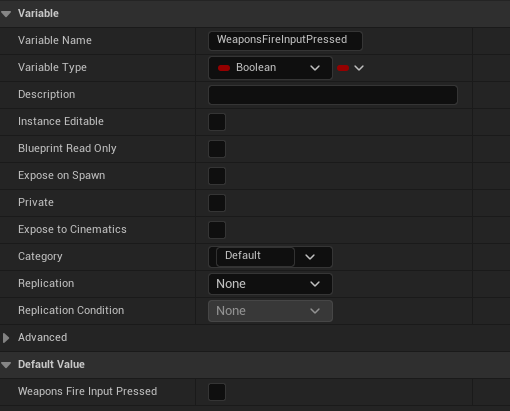
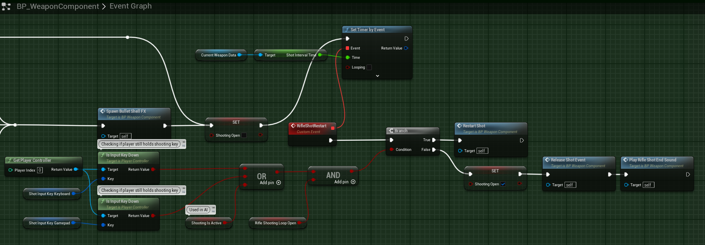
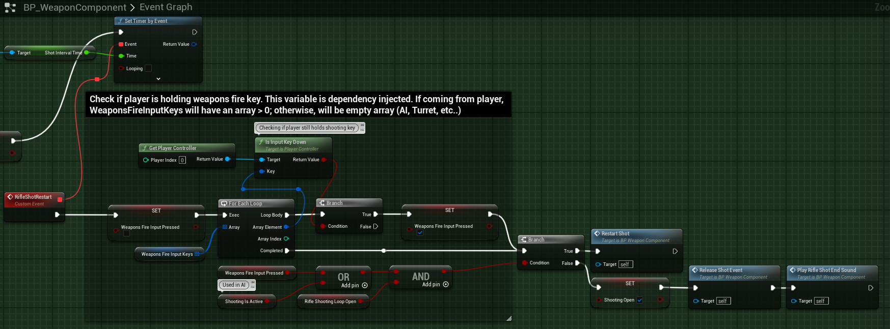
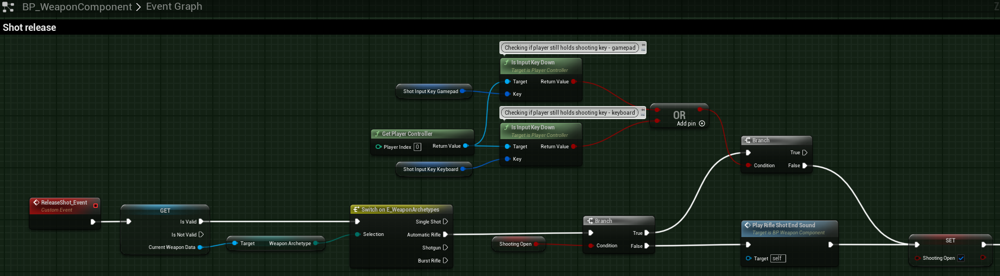
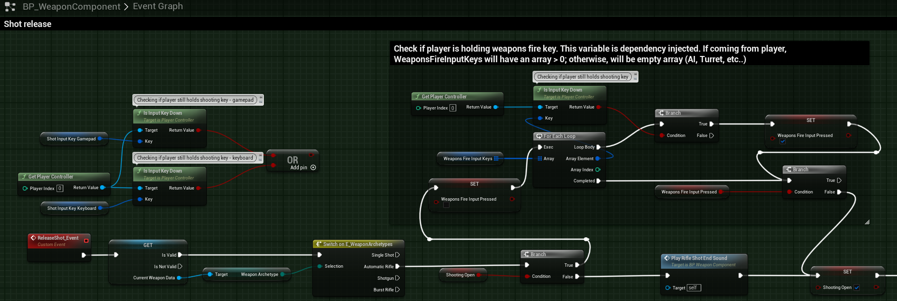
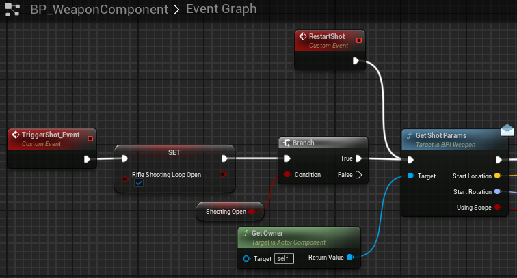
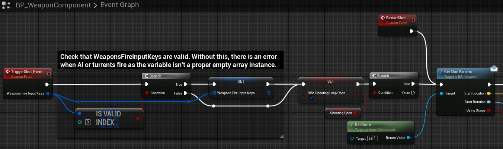
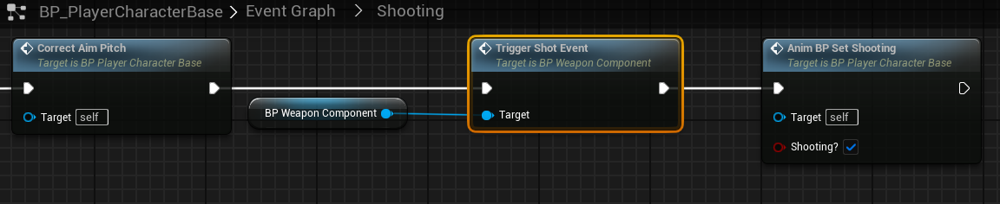
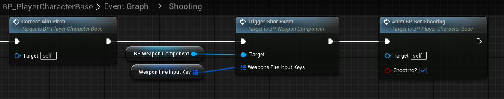

# `IA_Weapon_Fire`

## Add Player EnhancedInputAction for `IA_Weapon_Fire`.

#### Weapon Fire

>`BP_PlayerCharacterBase` -> `Event Graph` -> `Shooting`
>
>Replace the following `Input Mappings`:
>
>`InputAction Shoot` -> `EnhancedInputAction IA_Weapon_Fire`
>
>

#### Melee Attacks and Stealth Kill

>`BP_PlayerCharacterBase` -> `Melee Attacks and Stealth Kill`
>
>Replace the following `Input Mappings`:
>
>`InputAction Shoot` -> `EnhancedInputAction IA_Weapon_Fire`
>
>

## Modify BP_WeaponComponent

Due to how we have changed mapping for the input actions, we need to change how the BP_Weapon_Component handles the fire key presses to determine if the rifle or other guns need to continue firing in the event the fire weapon is still pressed.

To begin, inside the `BP_WeaponComponent`, create two new variables:

1. `WeaponsFireInputKeys`

   

2. `WeaponsFireInputPress`

   

>`BP_WeaponComponent` -> `Assault Rifle`
>
> Modify the logic after `RifleShotRestart`. The new logic will be added between `RifleShotRestart` and `Branch`. This logic will enable the `WeaponsFireInputKeys` Array to be iterated through to deterimine if any of the `EnhancedInput` keys are pressed, which indicate the player is intending to keep firing. In the event there's multiple keys, such as mouse, keybaord, and controller inputs, we will exit the loop at the first occurence of `true`.  Notice that `WeaponsFireInputPressed` is reset to false before the loop occurs. This is to reset the variable to false in order to overwrite to `true` if needed.
>
> Original code:
>
> 
>
> New Code:
>
> 

>`BP_WeaponComponent` -> `Assault Rifle` > `Shot Reset`
>
> Modify the logic after the `Branch` proceeding `Switch on E_WeaponsArchtypes`. The original `Branch True` logic needs to be replaced with similar logic to iterate through the the `WeaponsFireInputKeys` like in the previous step. Notice that `WeaponsFireInputPressed` is reset to false before the loop occurs. This is to reset the variable to false in order to overwrite to `true` if needed.
>
>> **NOTE*: Since this function occurs in more than one place, it would also be proper to create a helper function to perform this activity. This way, the code only lives in one place and can be called multiple times for each occurance. I do no do this in this tutorial. If this was created as a separate function, then the return value would be the `true/false` `boolean` value that would replace the `WeaponsFireInputPressed` variable.*
>
> Original code:
>
> 
>
> New Code:
>
> 

The final change for the BP_WeaponComponent is for us to modify the `TriggerShot_Event` which starts the entire `Event Graph`. First, we must change the event such that it receives an input of `WeaponsFireInputKeys`, which is an `Array` of type `Keys`. Next, we add in validation logic to ensure that the received input is valid before setting the local variable `WeaponsFireInputKeys`. The reason is that we will pass this value in from the `BP_PlayerCharacterBase` but we will not do this for any AI, Turrent, or other blueprint. If we do not have this logic, then when an AI or turret goes to shoot a weapon that would qualify for rapid fire, UE will crash out. This is because we will have a null instance as the pass in, which would then be set to the local variable and would cause an issue when we start to iterate through the Array as it is not yet set to an instance of an object. If this validation returns false (as it would with AI, Turret, etc...), then the local variable is a simple `Keys` `Array` of size (0).

>`BP_WeaponComponent` -> `Assault Rifle`
>
> Now, we must modify the `TriggerShot_Event`.
>
> Original code:
>
> 
>
> New Code:
>
> 

## Modify `BP_PlayerCharacterBase` -> `Event Graph` -> `Shooting`

Lastly, we must modify the BP_PlayerCharacterBase `TriggerShot_Event` function call so that we can pass in the list of user mapped `WeaponsFireInputKey`.

>`BP_PlayerCharacterBase` -> `Event Graph` -> `Shooting`
>
> Modify the input to `TriggerShot_Event`.
>
> Original code:
>
> 
>
> New Code:
>
> 