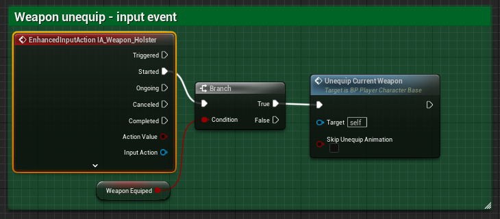

# `IA_EquipWeaponSlot_[##]`

## Add Player EnhancedInputAction for `IA_Weapon_Holster`.

### Add Player EnhancedInputAction to Weapon Equip.

>`BP_PlayerCharacterBase` -> `Event Graph` -> `Weapon Equip` -> `Weapon Unequip-Input Event`
>
>Replace the following `Input Mappings`:
>
>`InputAction HolsterWeapon` -> `EnhancedInputAction IA_Weapon_Holster`
>
>