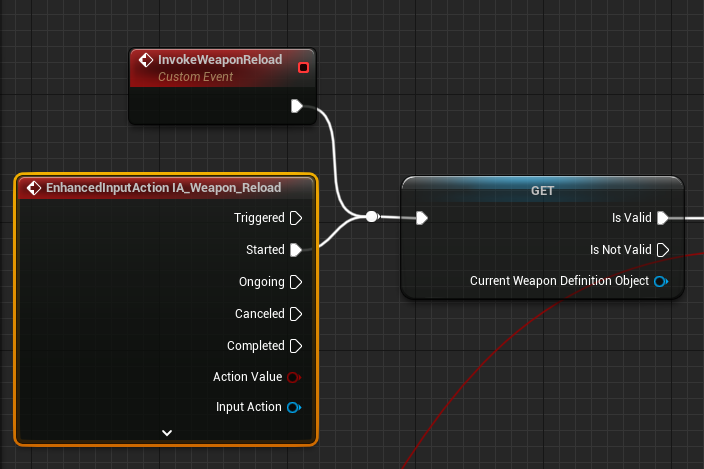

# `IA_Weapon_Reload`

## Add Player EnhancedInputAction for `IA_Weapon_Reload`.

### Weapon Reload

>`BP_PlayerCharacterBase` -> `Event Graph` -> `Reloading`
>
>Replace the following `Input Mappings`:
>
>`InputAction Reload` -> `EnhancedInputAction IA_Weapon_Reload`
>
>