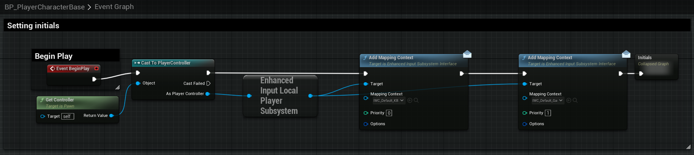
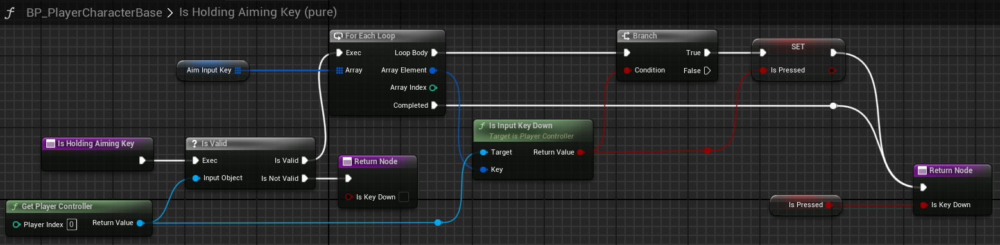

# Third Person Shooter Kit Enhanced Input Migration

This document details the steps for migrating TPSK from the *Legacy* `InputAction` to the `EnhancedInput`. Found collocated in the `EnhancedInput` folder. This folder contains the required `InputActions` and `InputMapping` files required. I have not yet implemented user settings or other advanced configs yet; however, this should be enough to get everyone started.

## TPS-K Enhanced Keyboard + Mouse Mapping

### IMC_DEFAULT_KBM
This is the **New** default mapping file for Keyboard + Mouse user mapping. The table below shows the *Original/Legacy* `Action Mapping` against the *new* `Enhanced Input Mapping`.

#### Input - Action Mappings (Legacy)

| Action Mappings (Original) | Original Key(s) | Enhanced Input Mapping Action | Enhanced Action Key | \*\*TODO/Notes\*\* |
| :--- | :---: | :---: | :---: | :---: |
| Aiming | Left MB, Right MB | [IA_Aiming](./EnhancedInputActions/IA_Aiming.md) | Right MB | Aiming is now user mappable. Look in logic, if firing, initiate Aiming if Aiming isn't already pressed.  |
| Any Key Input | \<AnyKey\> | [IA_AnyKey](./EnhancedInputActions/IA_AnyKey.md) | \<AnyKey\> |  |
| CameraCenter | Z | [IA_Center_Camera](./EnhancedInputActions/IA_Center_Camera.md) | Z |  |
| Crouch | Left Ctrl | [IA_Crouch](./EnhancedInputActions/IA_Crouch.md) | Left Ctrl, Right Ctrl |  |
| Jump | Space Bar | [IA_Jump](./EnhancedInputActions/IA_Jump.md) | Space Bar |  |
| Melee Attack | Q | [IA_Melee](./EnhancedInputActions//IA_Melee.md) | X, Middle Mouse Button | Need a lock on nearest target or something to make this more accurate. |
| Next Weapon | E, Mouse Wheel Up | [IA_Weapon_Next](./EnhancedInputActions/IA_Weapon_Next.md) | E, Mouse Wheel Up |  |
| Pause Game | 4 | [IA_Pause_Game](./EnhancedInputActions/IA_Pause_Game.md) | 4 | Want to update to `Escape Key` |
| Previous Weapon | Mouse Wheel Down | [IA_Weapon_Previous](./EnhancedInputActions/IA_Weapon_Previous.md) | Q, Mouse Wheel Down | Doesn't appear to be hooked up initially |
| Reload | R | [IA_Weapon_Reload](./EnhancedInputActions/IA_Weapon_Reload.md) | R |  |
| RollCoverLadder | C | [IA_Roll_Cover_Ladder](./EnhancedInputActions/IA_Roll_Cover_Ladder.md) | C | Refactor Roll to double tap Crouch/Slide |
| Shoot | Left Mouse Button | [IA_Weapon_Fire](./EnhancedInputActions/IA_Weapon_Fire.md) | Left Mouse Button |  |
| Slide | Left Ctrl | [IA_Slide](./EnhancedInputActions/IA_Slide.md) | Left Ctrl | Refactor Crouch and Slide to be the same action |
| Sprint | Left Shift | [IA_Sprint](./EnhancedInputActions//IA_Sprint.md) | Left Shift |  |
| Toggle Camera | Tab | [IA_Toggle_Camera](./EnhancedInputActions/IA_Toggle_Camera.md) | Tab | Rename to align with shift left/right handed. There is a time delay on Tab action in original action. Maybe do a transition animation for the hands to be more realistic. |
| Use | F | [IA_Use](./EnhancedInputActions/IA_Use.md) | F |  |
| EquipWeaponSlot01 | 1 | [IA_EquipWeaponSlot01](./EnhancedInputActions/IA_EquipWeaponSlot.md) | 1 |  |
| EquipWeaponSlot02 | 2 | [IA_EquipWeaponSlot02](./EnhancedInputActions/IA_EquipWeaponSlot.md) | 2 |  |
| EquipWeaponSlot03 | 3 | [IA_EquipWeaponSlot03](./EnhancedInputActions/IA_EquipWeaponSlot.md) | 3 |  |
| Holster Weapon | T | [IA_Weapon_Holster](./EnhancedInputActions/IA_Weapon_Holster.md) | H | *Renamed to `H` key for `holster`.* |
| FPPAiming | E | [IA_FPPAiming](./EnhancedInputActions/IA_FPPAiming.md) | R | Change mapping to `Shift Key(s)` and ensure no key conflict |
| SniperRifleZoom | Z | [IA_SniperRifle_Zoom](./EnhancedInputActions/IA_SniperRifle_Zoom.md) | Z | Should also be `Shift Key` for standardization |
| GrenadeThrow | Middle Mouse Button | [IA_Grenade_Throw](./EnhancedInputActions/IA_Grenade_Throw.md) | G | Add Grenade cook timer? |
| GrenadeThrowCancel | Tab | [IA_Grenade_Cancel](./EnhancedInputActions/IA_Grenade_Cancel.md) | Tab | Find what other games use as a standard. Tab seems strange. |
| Stealth Kill | Middle Mouse Button | [IA_StealthKill](./EnhancedInputActions/IA_StealthKill.md) | Middle Mouse Button | Make sure it doesn't interfere with MMB Melee |
| --- | --- | [IA_Movement](./EnhancedInputActions/IA_Movement.md) | W, A, S, D, Up, Down, Left, Right | New movement on 2d X+Y Axis. |
| --- | --- | [IA_Look_Mouse](./EnhancedInputActions/IA_Look_Mouse.md) | Mouse XY 2D-Axis | Handles X+Y mouse movement. Need to add invert function |

#### Input - Axis Mappings (Legacy)

| Action Mappings (Original) | Original Key(s) | Enhanced Input Mapping Action | Enhanced Action Key | \*\*TODO/Notes\*\* |
| :--- | :---: | :---: | :---: | :---: |
| LookUp | Mouse Y | --- | --- | *Not needed! This should be tied to* `IA_Look_Mouse` *that has 2d X+Y Axis.* |
| LookUpMouse | Mouse Y | --- | --- | *Not needed! This should be tied to* `IA_Look_Mouse` *that has 2d X+Y Axis.* |
| MoveForward | W, S, Up, Down | --- | --- | *Is this even needed? This should be tied to* `IA_Movement` *that has 2d X+Y Axis.* |
| MoveRight | A, D | --- | --- | Is this even needed? This should be tied to* `IA_Movement` *that has 2d X+Y Axis.* |
| Move Sideways | A, D, Left, Right | --- | --- |Is this even needed? This should be tied to* `IA_Movement` *that has 2d X+Y Axis.* |
| Turn | Mouse X | --- | --- | *Is this even needed? This should be tied to* `IA_Look_Mouse` *that has 2d X+Y Axis.* |
| TurnRate | Left, Right | --- | --- | *Not sure what this does, will add if I find that I need it for anything...* |

### IMC_Default_GamePad

#### Input - Action Mappings (Legacy)

| Action Mappings (Original) | Original Key(s) | Enhanced Input Mapping Action | Enhanced Action Key | \*\*TODO/Notes\*\* |
| :--- | :---: | :---: | :---: | :---: |
| Aiming | --- | [IA_Aiming](./EnhancedInputActions/IA_Aiming.md) | Left Trigger | Aiming is now user mappable. Look in logic, if firing, initiate Aiming if Aiming isn't already pressed.  |
| Any Key Input | --- | [IA_AnyKey](./EnhancedInputActions/IA_AnyKey.md) | \<AnyButton\> |  |
| CameraCenter | Right Thumbstick Button | [IA_Center_Camera](./EnhancedInputActions/IA_Center_Camera.md) | Right Thumbstick Button |  |
| Crouch | Left Shoulder | [IA_Crouch](./EnhancedInputActions/IA_Crouch.md) | Face Button Right (XBox B) |  |
| Jump | Face Button Bottom | [IA_Jump](./EnhancedInputActions/IA_Jump.md) | Face Button Bottom (XBox A) |  |
| Melee Attack | Right Shoulder | [IA_Melee](./EnhancedInputActions//IA_Melee.md) | Right Shoulder | Need a lock on nearest target or something to make this more accurate. |
| Next Weapon | D-pad Right | [IA_Weapon_Next](./EnhancedInputActions/IA_Weapon_Next.md) | D-pad Right |  |
| Pause Game | Special Right | [IA_Pause_Game](./EnhancedInputActions/IA_Pause_Game.md) | Special Right |  |
| Previous Weapon | D-pad Left | [IA_Weapon_Previous](./EnhancedInputActions/IA_Weapon_Previous.md) | D-pad Left | Doesn't appear to be hooked up initially |
| Reload | Face Button Left | [IA_Weapon_Reload](./EnhancedInputActions/IA_Weapon_Reload.md) | Face Button Left (XBox X) |  |
| RollCoverLadder | Face Button Right | [IA_Roll_Cover_Ladder](./EnhancedInputActions/IA_Roll_Cover_Ladder.md) | Right Shoulder | Refactor Roll to double tap Crouch/Slide, Maybe Cover and Ladder should be `Use` action button? |
| Shoot | Right Trigger | [IA_Weapon_Fire](./EnhancedInputActions/IA_Weapon_Fire.md) | Right Trigger |  |
| Slide | Left Shoulder | [IA_Slide](./EnhancedInputActions/IA_Slide.md) | Left Shoulder | Refactor Crouch and Slide to be the same action |
| Sprint | Left Thumbstick Button | [IA_Sprint](./EnhancedInputActions//IA_Sprint.md) | Left Thumbstick Button |  |
| Toggle Camera | Face Button Top | [IA_Toggle_Camera](./EnhancedInputActions/IA_Toggle_Camera.md) | Face Button Top (XBox Y) | Rename to align with shift left/right handed. There is a time delay on Tab action in original action. Maybe do a transition animation for the hands to be more realistic. |
| Use | Face Button Top | [IA_Use](./EnhancedInputActions/IA_Use.md) | Face Button Top (Xbox Y) |  |
| EquipWeaponSlot01 | D-pad Left | [IA_EquipWeaponSlot01](./EnhancedInputActions/IA_EquipWeaponSlot.md) | Dp-ad Left | Need to build a special combo for this to add functionality. Left Trigger + D-pad Left or something... |
| EquipWeaponSlot02 | D-pad Up | [IA_EquipWeaponSlot02](./EnhancedInputActions/IA_EquipWeaponSlot.md) | D-pad Up |  |
| EquipWeaponSlot03 | D-pad Right | [IA_EquipWeaponSlot03](./EnhancedInputActions/IA_EquipWeaponSlot.md) | D-pad Right |  |
| Holster Weapon | D-pad Down | [IA_Weapon_Holster](./EnhancedInputActions/IA_Weapon_Holster.md) | D-pad Down |  |
| FPPAiming | Face Button Top | [IA_FPPAiming](./EnhancedInputActions/IA_FPPAiming.md) | Face Button Top (XBox Y) | Change mapping to `Shift Key(s)` and ensure no key conflict |
| SniperRifleZoom | Right Thumbstick Button | [IA_SniperRifle_Zoom](./EnhancedInputActions/IA_SniperRifle_Zoom.md) | Right Thumbstick Button | This should also be the FPP key for this instance. Need to set and debug as needed. |
| GrenadeThrow | Right Thumbstick Button | [IA_Grenade_Throw](./EnhancedInputActions/IA_Grenade_Throw.md) | Right Thumbstick Button | Add Grenade cook off timer? |
| CameraCenterSecondButton | Left Thumbstick Button | --- | --- | Not Needed, need to remove any reference in code. |
| GrenadeThrowCancel | Right Shoulder | [IA_Grenade_Cancel](./EnhancedInputActions/IA_Grenade_Cancel.md) | Right Shoulder | Could use fire button to throw grenade so letting off throw button would cancel throw. |
| Stealth Kill | Face Button Left | [IA_StealthKill](./EnhancedInputActions/IA_StealthKill.md) | Face Button Left | Make sure it doesn't interfere with MMB Melee |
| --- | --- | [IA_Movement](./EnhancedInputActions/IA_Movement.md) |  Left Thumbstick Y-Axis, X-Axis | New movement on 2d X+Y Axis. |
| --- | --- | [IA_Look_Mouse](./EnhancedInputActions/IA_Look_Mouse.md) | Right Thumbstick XY 2D-Axis | Handles X+Y axis of Thumbstick. Maybe rename to exclude Mouse specific.  |

#### Input - Axis Mappings (Legacy)

| Action Mappings (Original) | Original Key(s) | Enhanced Input Mapping Action | Enhanced Action Key | \*\*TODO/Notes\*\* |
| :--- | :---: | :---: | :---: | :---: |
| LookUpGamepad | --- | --- | --- | *Is this even needed? This should be tied to* `IA_Look_Mouse` *that has 2d X+Y Axis.* |
| MoveForward | --- | --- | --- | *Is this even needed? This should be tied to* `IA_Movement` *that has 2d X+Y Axis.* |
| MoveRight | --- | --- | --- | Is this even needed? This should be tied to* `IA_Movement` *that has 2d X+Y Axis.* |
| Move Sideways | --- | --- | --- |Is this even needed? This should be tied to* `IA_Movement` *that has 2d X+Y Axis.* |
| Turn Right/Left | --- | --- | --- | *Is this even needed? This should be tied to* `IA_Look_Mouse` *that has 2d X+Y Axis.* |
| TurnRate | --- | --- | --- | *Not sure what this does, will add if I find that I need it for anything...* |

## Mapping Implementation.

The next steps describe how to implement the new `EnhancedInput` feature. Unless otherwise specified, the following changes will all be with `BP_PlayerCharacterBase` blueprint file located at `Content/ThirdPersonKit/Blueprints/BP_PlayerCharacterBase`.

### Add Player Context Mappings (BP)

To enable the new `Enhanced Input` to register input for gameplay, the new `Enhanced Input` needs to be added to the `Mapping Context`. This is done in `BP_PlyerCharacterBase`, adding the following changes to the `Event Graph` -> `Setting Initials`.

>We need to:
>1. Get Controller
>2. Cast `Get Controller` to `PlayerController`
>3. Get the `Enhanced Input Local Player Subsystem` from the `As Player Controller`.
>4. `Add Mapping Context` targeting the Mapping Context: `IMC_Default_KBM` with the `Enhanced Input >Local Player Subsystem` as the `Target`.
>5. `Add Mapping Context` targeting the Mapping Context: `IMC_Default_GamePad` with the `Enhanced >Input Local Player Subsystem` as the `Target`.
>6. Call `Initials` after setting both `Mapping Context`.
>
>

### New Function to GetActionKeysPressed

Now we need to fix the logic behind checking if the player is holding down one of the new `IA_` action buttons or keys.

>First, create a new function called `GetActionPressedKeys`. The function input will be called `Action` and will have type `Input Action`. The function outputs will be called `PressedKeys` and will be an `Array` of type `Key`.
>
>This function will get the player controller, get the `EnhancedInputLocalPlayerSubsystem` and then call `QueryKeysMappedToAction` in order to get an array of all keys mapped with that action. With our setup, this will include both Keyboard and Mouse as well as Controller mappings.
>
>After we have queried the list of actions, we will iterate through each Array object in the `For Each Loop` and we will add each key assignment to a local variable `LocalPresedKeys`, which is an `Array` of type `Key`. We return this list upon completion of the loop. 
>
>


### Add Initial Key Mapping

We need to ensure they initial key mapping occurs for the character. Unfortunately, the original implementation during the `ConstructionScript` will not be sufficient. Instead, we need to create a new group of functions.

>1. Create a new new variable under `TPS Input Keys` called `Weapons_Fire_InputKey`. This will be an `Array` of type `Key`. 
> > 
>
>2. Create a new new variable under `TPS Input Keys` called `Aim_InputKey`. This will be an `Array` of type `Key`. 
> > 
>
>3. Create a new new variable under `TPS Input Keys` called `Crouch_InputKey`. This will be an `Array` of type `Key`.
> > 
>
> Your variables should be found under `TPS Input Keys`.
>
>

>Next, in the `EventGraph`, find the green commented section for `Pawn possessed/unpossessed`. At the end of the call stack, we will add a call to set `WeaponFireInputKey`, `AimInputKey`, and `CrouchInputKey` with their input coming from their respective `GetActionPressedKeys`. After creating this, you may collapse the nodes to make them smaller in the event graph. We can rename it to something useful such as `SetInputKeys`.
>
>
>
>
>
>***NOTE:*** The reason we apply the key bindings this after the player is possessed is to ensure that whenever the player is respawned, that the mappings are properly applied/reapplied.

### Modify `IsHolding<*>Key` Functions

Since we are now going to hold a list of assigned action keys, we need to be able to iterate and check each key to see if it's down. If it is, then we set a local variable called `IsPressed`, then immediately return the boolean value (*no need to check every key, return on the first `True` find*).

>We need to modify the following 3 functions:

>1. `IsHoldingAimingKey`
>
>
>
>2. `IsHoldingShotKey`
>
>
>
>3. `IsHoldingCrouchKey`
>
>

## Input Actions:

- [IA_Aiming](./EnhancedInputActions/IA_Aiming.md)
- [IA_AnyKey](./EnhancedInputActions/IA_AnyKey.md)
- [IA_Center_Camera](./EnhancedInputActions/IA_Center_Camera.md)
- [IA_Crouch](./EnhancedInputActions/IA_Crouch.md)
- [IA_EquipWeaponSlot01](./EnhancedInputActions/IA_EquipWeaponSlot.md)
- [IA_EquipWeaponSlot02](./EnhancedInputActions/IA_EquipWeaponSlot.md)
- [IA_EquipWeaponSlot03](./EnhancedInputActions/IA_EquipWeaponSlot.md)
- [IA_FPPAiming](./EnhancedInputActions/IA_FPPAiming.md)
- [IA_Grenade_Cancel](./EnhancedInputActions/IA_Grenade_Cancel.md)
- [IA_Grenade_Throw](./EnhancedInputActions/IA_Grenade_Throw.md)
- [IA_Jump](./EnhancedInputActions/IA_Jump.md)
- [IA_Look_Mouse](./EnhancedInputActions/IA_Look_Mouse.md)
- [IA_Look_Mouse](./EnhancedInputActions/IA_Look_Mouse.md)
- [IA_Melee](./EnhancedInputActions//IA_Melee.md)
- [IA_Movement](./EnhancedInputActions/IA_Movement.md)
- [IA_Pause_Game](./EnhancedInputActions/IA_Pause_Game.md)
- [IA_Roll_Cover_Ladder](./EnhancedInputActions/IA_Roll_Cover_Ladder.md)
- [IA_Slide](./EnhancedInputActions/IA_Slide.md)
- [IA_SniperRifle_Zoom](./EnhancedInputActions/IA_SniperRifle_Zoom.md)
- [IA_Sprint](./EnhancedInputActions//IA_Sprint.md)
- [IA_StealthKill](./EnhancedInputActions/IA_StealthKill.md)
- [IA_Toggle_Camera](./EnhancedInputActions/IA_Toggle_Camera.md)
- [IA_Toggle_Flashlight](./EnhancedInputActions/IA_Toggle_Flashlight.md)
- [IA_Use](./EnhancedInputActions/IA_Use.md)
- [IA_Weapon_Fire](./EnhancedInputActions/IA_Weapon_Fire.md)
- [IA_Weapon_Holster](./EnhancedInputActions/IA_Weapon_Holster.md)
- [IA_Weapon_Next](./EnhancedInputActions/IA_Weapon_Next.md)
- [IA_Weapon_Previous](./EnhancedInputActions/IA_Weapon_Previous.md)
- [IA_Weapon_Reload](./EnhancedInputActions/IA_Weapon_Reload.md)
- [BP_Button_Panel_EnhancedInput](./EnhancedInputActions/BP_Button_Panel_EnhancedInput.md)

## Clean up Construction Script

Now that we have migrated over to the new `EnhancedInput` actions and set the mapping context at on player possession, we can remove the `Storing input keys based on action mappings` from the construction script. None of these values are needed or used. Double check by right clicking and seeing if there are any references outside of the construction script. Same with th `GetActionMappingKeys` function. Delete all of these.

>

Next, we can cleanup the associated variables:

> Remove the following variables under `TPS Input Keys`
>
> | Variable | Type |
> | --- | --- |
> | `ShotInputKeyKeyboard` | `Key` |
> | `AimingInputKeyKeyboard` | `Key` |
> | `CrouchingInputKeyKeyboard` | `Key` |
> | `ShotInputKeyGamepad` | `Key` |
> | `AimingInputKeyGamepad` | `Key` |
> | `CrouchingInputKeyGamepad` | `Key` |>
>
>

Lastly, we no longer need the `Legacy Input` bindings. To remove these, open the project settings: `Edit` -> `Project Settings`.


Scroll down to `Engine` -> `Input`.


## Clean up `DefaultGame.ini`

With the migration to `EnhancedInput`, UE may now start flagging an issue that looks like this:

```
EditorErrors: Warning: Click to open file Found a deprecated ini key name in ../../../../../../Users/nicho/UnrealEngine/Projects/TPSK_EnhancedInput_Test/Config/DefaultGame.ini. Search for [IniKeyBlacklist] and replace with [IniKeyDenylist]
LogConfig: Warning: Found a deprecated ini key name in ../../../../../../Users/nicho/UnrealEngine/Projects/TPSK_EnhancedInput_Test/Config/DefaultGame.ini. Search for [IniKeyBlacklist] and replace with [IniKeyDenylist]
```

To resolve this, go into the the `DefaultGame.ini` file and find/replace instances of IniKeyBlacklist, replacing for IniKeyDenylist.

